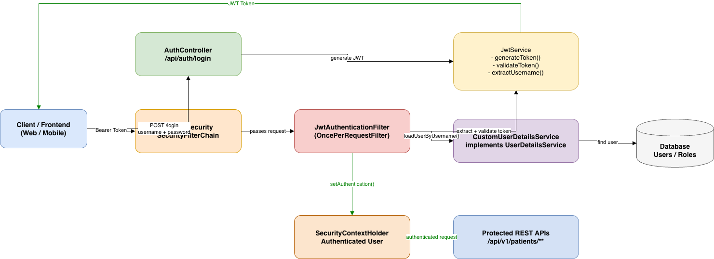

# WCC Mentorship 2026 — Session 1: Hospital Patient Management API

## Architecture
 

## What's covered

- **Versioned REST API** v1/v2
- **REST API Best practices** 
- **JWT Security** — stateless auth; GETs are public, mutations require a token
- **Architecture MVC** 
- **Spring Advice** — structured error responses with `@RestControllerAdvice`
- **Bean Validation** — `@Past` on DOB, `@Pattern` on gender/status, `@Email` on email
- **Springdoc OpenAPI** — Swagger UI at `/swagger-ui.html` with Bearer auth
- **Tests** — pure JUnit 5, zero Mockito

---

## Running

```bash
./mvnw spring-boot:run
```

Swagger UI: http://localhost:8080/hospital/swagger-ui.html

---

## Getting a token

```bash
# Doctor
curl -X POST http://localhost:8080/api/auth/login \
  -H "Content-Type: application/json" \
  -d '{"username":"doctor","password":"password"}'

# Nurse
curl -X POST http://localhost:8080/api/auth/login \
  -H "Content-Type: application/json" \
  -d '{"username":"nurse","password":"password"}'
```

---

## API Examples

```bash
# List all patients (public, v1 — basic info)
curl http://localhost:8080/api/v1/patients

# Full details (public, v2)
curl http://localhost:8080/api/v2/patients

# Filter by ward
curl "http://localhost:8080/api/v2/patients?ward=ICU"

# Filter by admission status
curl "http://localhost:8080/api/v2/patients?status=ADMITTED"

# Register a patient (authenticated)
curl -X POST http://localhost:8080/api/v1/patients \
  -H "Authorization: Bearer <TOKEN>" \
  -H "Content-Type: application/json" \
  -d '{
    "firstName": "Anna",
    "lastName": "Smith",
    "nationalId": "NHS-2000000001",
    "dateOfBirth": "1992-03-14",
    "gender": "FEMALE",
    "bloodType": "B+",
    "phoneNumber": "+44 7700 123456",
    "email": "anna.smith@email.com",
    "address": "22 Hospital Road, London",
    "ward": "General",
    "admissionStatus": "ADMITTED",
    "admissionDate": "2024-03-15"
  }'

# Discharge a patient
curl -X PATCH http://localhost:8080/api/v1/patients/1/discharge \
  -H "Authorization: Bearer <TOKEN>"
```

---

## Task checklist TO DO 

- [ ] Task 1 — Role-based access  (Verify that a NURSE gets 403 Forbidden/ Verify that a DOCTOR gets 204 No Content)
- [ ] Task 2 — New field (Add a critical boolean field to Patient and PatientRequest.  Expose it in PatientResponseV2 but NOT  in PatientResponseV1 / Default it to false on registration )
- [ ] STUDY — Chapter 4 - Rate limiter